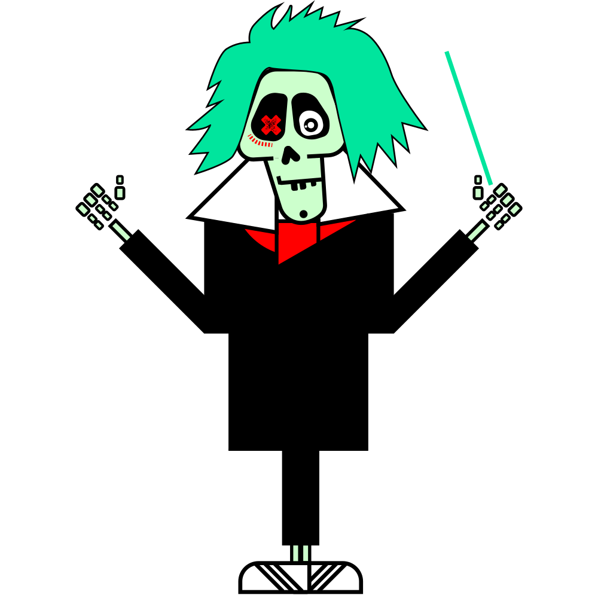

# Brand Assets

## Logo

### BeethovenX

- [beethovenx.pdf](https://github.com/beethovenxfi/brand-assets/blob/main/logo/beethovenx.pdf)
- [beethovenx.svg](https://github.com/beethovenxfi/brand-assets/blob/main/logo/beethovenx.svg)
- [beethovenx@2x.png](https://github.com/beethovenxfi/brand-assets/blob/main/logo/beethovenx@2x.png)
    

### Beets rocking

- [beets-rocking.pdf](https://github.com/beethovenxfi/brand-assets/blob/main/logo/beets-rocking.pdf)
- [beets-rocking.svg](https://github.com/beethovenxfi/brand-assets/blob/main/logo/beets-rocking.svg)
- [beets-rocking@2x.png](https://github.com/beethovenxfi/brand-assets/blob/main/logo/beets-rocking@2x.png)
    

### Beets stacking

- [beets-stacking.pdf](https://github.com/beethovenxfi/brand-assets/blob/main/logo/beets-stacking.pdf)
- [beets-stacking.svg](https://github.com/beethovenxfi/brand-assets/blob/main/logo/beets-stacking.svg)
- [beets-stacking@2x.png](https://github.com/beethovenxfi/brand-assets/blob/main/logo/beets-stacking@2x.png)
    

### Beets

- [beets.pdf](https://github.com/beethovenxfi/brand-assets/blob/main/logo/beets.pdf)
- [beets.svg](https://github.com/beethovenxfi/brand-assets/blob/main/logo/beets.svg)
- [beets@2x.png](https://github.com/beethovenxfi/brand-assets/blob/main/logo/beets@2x.png)
    

### Ludwig conductor

- [ludwig-conductor.pdf](https://github.com/beethovenxfi/brand-assets/blob/main/logo/ludwig-conductor.pdf)
- [ludwig-conductor.svg](https://github.com/beethovenxfi/brand-assets/blob/main/logo/ludwig-conductor.svg)
- [ludwig-conductor@2x.png](https://github.com/beethovenxfi/brand-assets/blob/main/logo/ludwig-conductor@2x.png)
    
